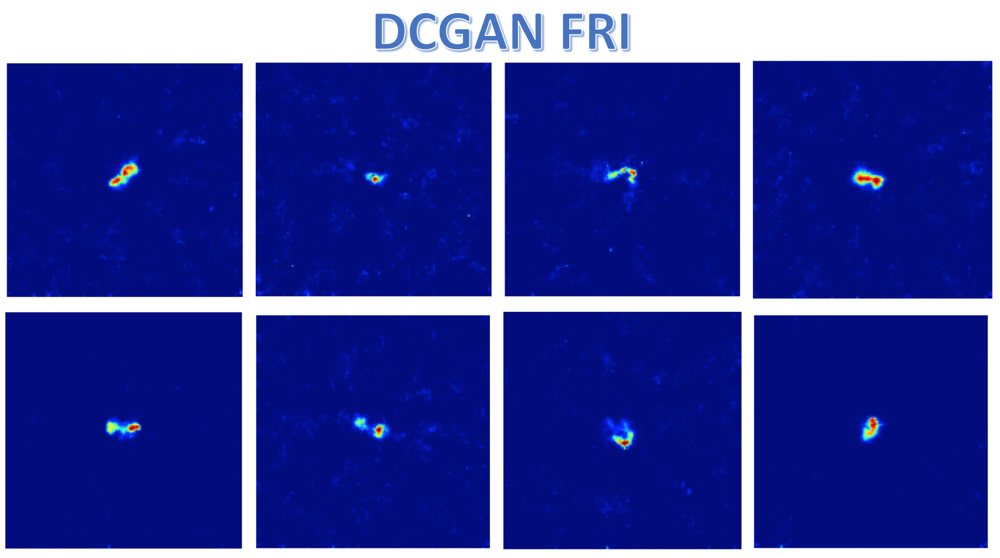
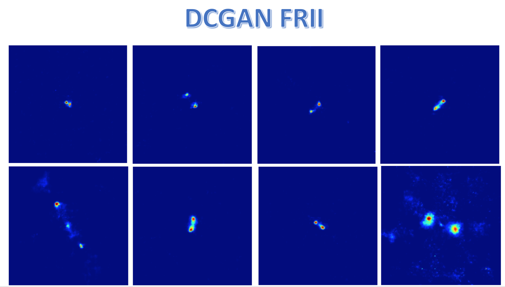
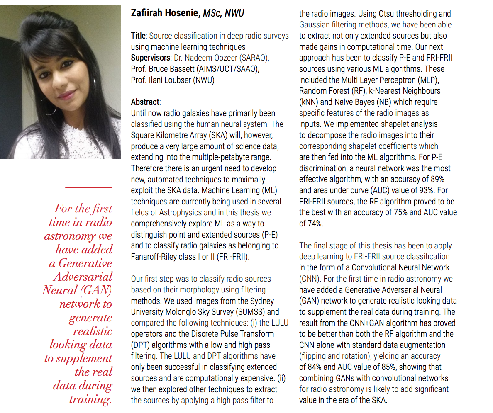

# FRI-FRII-Simulation-using-DCGAN

Implementaion of Deep Convolutional Generative Adversarial Network using [DCGAN in Tensorflow](https://github.com/carpedm20/DCGAN-tensorflow) code. Detailed information can be found in this [paper](https://arxiv.org/abs/1511.06434). 

FRI and FRII sources are rare candidates. To be able to apply convolutional neural network for classification of these two sources, one needs to gather a large amount of data. Using real data of FRI and FRII sources, DCGAN has been used as a simulator. Here are examples of generated FRI and FRII sources after training the DCGAN network. This work has been submitted as part of my Master thesis: [Source classification in deep radio surveys using machine learning techniques](https://repository.nwu.ac.za/handle/10394/31250).

A Summary of my MSc Project is as follows:

Usage
---

Training FRI sources

    python main.py --data new_FRI_augment --input_height=150 --output_height=150 --is_train --c_dim=1 --epoch=1152 --input_fname_pattern='*.fits'
    
Training FRII sources

    python main.py --dataset new_FRII_augment —input_height=150 —output_height=150 --c_dim=1 —batch_size=4 --epoch=100 --input_fname_pattern=‘*.fits’
    
    
Generate FRI examples after training the `DCGAN` network

    python main.py --model_dir=new_FRI_augment_100_150_150_1152 --input_height=100 --output_height=150 --c_dim=1 --batch_size=1 --nplt=10 --voption=6 --sample_dir=samples/sim_fits_NewFRI_augment/
    
Generate FRII example after training the `DCGAN` network

    python main.py --model_dir=new_FRII_augment_100_150_150_1152 --input_height=150 --output_height=150 --c_dim=1 --batch_size=1 --nplt=10 --voption=6 --sample_dir=samples/sim_fits_NewFRII_augment/
